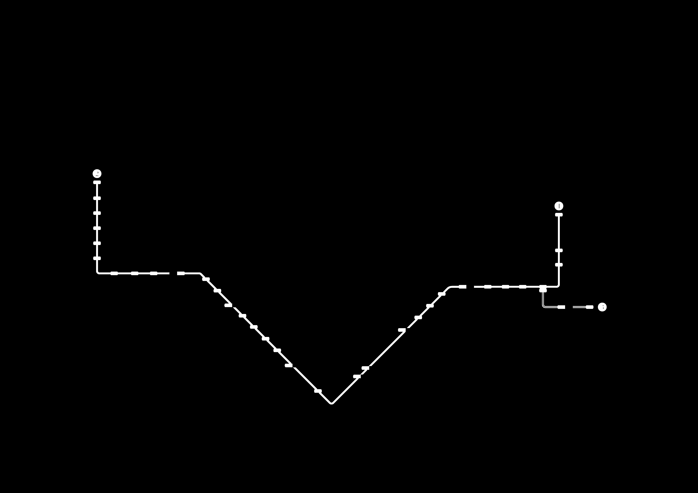
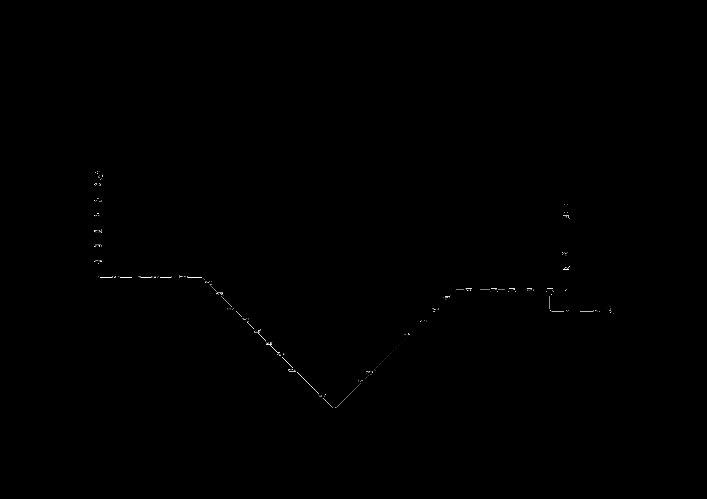

## Comparison of Extraction Methods

### Version 1 — Mask based extraction

**Key characteristics**

Version 1 starts by masking the target line’s colour, then applies closing, opening, and morphological dilation to smooth gaps and strengthen thin regions. 
The cleaned mask gives the Hough transform a clear and continuous shape to analyse, picking up small angled pieces and faint curves more reliably. 
The result is a dense set of short, accurate (but sometimes overlapping) segments that align closely with the schematic.

**Visual result**

- ✅ Very high sensitivity with strong coverage.
- ✅ Detects many short segments, including faint or curved areas.
- ❌ Generates a large number of line segments, increasing data size and making the output heavier to process.

---

### Version 2 — Edge based extraction

**Key characteristics**

Version 2 runs Canny edge detection instead. 
Canny extracts the thin outline of the Downtown Line, essentially reducing it to a one-pixel path. 
There is no morphological smoothing here, so the structure remains narrow. 
When the Hough transform sees this thinner edge map, it produces fewer but clearer line segments. That gives a much cleaner, more discrete-looking Downtown Line.
Higher Hough thresholds and longer minimum line length used, so shorter fragments get filtered out, strengthening precision.

**Visual result**

- ❌ Fewer segments, reduced coverage
- ❌ Curved sections break down into gaps or disappear entirely
- ✅ Straighter portions look clean, but overall geometry loses fidelity

## Visual Samples

### Binary Intermediate

| Mask + Morph Dilation (Version 1) | Edge Detection (Version 2) |
|-----------------|-----------------|
|  |  |

---

### Line Extraction Comparison (DTL + EWL)

| Version 1 | Version 2 |
|-----------------|-----------------|
|  |  |

---

### Overlay Demo

| Original MRT System Map | DTL(Version1) overlay |
|-----------------|-----------------|
|  |  |

---

### Current Limitations & Challenges

The current extraction process can identify and trace the full shape of an MRT line based on colour masking and Hough-based detection, yet the output treats the entire line as a single continuous entity. For the project to be functional, this line must be divided into meaningful segments, each carrying its own identifier that corresponds to the schematic. Achieving this segmentation automatically is challenging because the raw detection does not inherently recognise station boundaries, line breaks, or schematic-defined sections. As a result, reliably splitting the detected line into correctly indexed segments remains a key technical obstacle.
